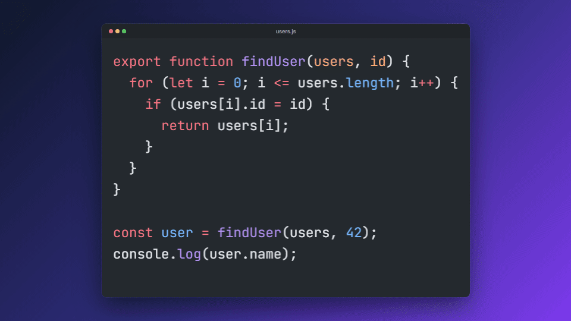

# diffreel

**Turn code changes into smooth animated videos.**

Give diffreel two versions of a file, a git commit, or a list of steps, and it renders an MP4, WebM or GIF in which the code morphs from one version to the next. Unchanged code slides into its new position, removed code fades out, and new code fades or types in, all with syntax highlighting. Use it for tutorials, YouTube videos, reels, shorts and social posts.

<p align="center">
  
</p>

[](https://www.npmjs.com/package/diffreel)
[](https://github.com/99proteam/diffreel/actions/workflows/ci.yml)
[](LICENSE)
[](https://buymeacoffee.com/99proteam)

- **Token-level magic move:** diffs by line, then by token, so `i <= n` becomes `i < n` by moving the tokens that stayed instead of retyping the line.
- **Syntax highlighting with [Shiki](https://shiki.style):** all VS Code themes and 200+ languages.
- **Runs locally:** no server, no account, no Remotion. diffreel uses headless Chromium plus a bundled ffmpeg.
- **Sharp text:** frames render at 2× device scale and are downsampled with Lanczos.
- **Made for social video:** 16:9, 9:16 reels and 1:1 square presets, captions, window frame, typing effect and change highlights.
- **Handles long files:** the viewport auto-scrolls to keep the changed region centered.

## Install

```bash
npm install -g diffreel          # or use npx diffreel ...
npx playwright install chromium  # one-time: the headless browser used to draw frames
```

You need Node.js 20 or newer. ffmpeg is bundled through [`ffmpeg-static`](https://www.npmjs.com/package/ffmpeg-static), so you don't install it yourself.

## Three ways to use it

### 1. Two files

```bash
npx diffreel before.ts after.ts -o out.mp4
```

Pass more files to chain them: `diffreel v1.ts v2.ts v3.ts -o out.mp4`.

### 2. A git commit

```bash
npx diffreel --git HEAD~1..HEAD --file src/app.ts -o out.mp4
```

- `A..B` creates one step for the file at `A`, then one per commit in the range that touched the file.
- A single commit `X` means `X~1..X`.
- `HEAD..` animates from `HEAD` to your uncommitted working tree.
- `--commit-captions` uses each commit message as the caption.

### 3. A steps file (a whole tutorial in one video)

```bash
npx diffreel steps.json -o out.mp4
```

```json
{
  "filename": "Counter.tsx",
  "lang": "tsx",
  "theme": "tokyo-night",
  "size": "reel",
  "window": true,
  "typing": true,
  "steps": [
    { "code": "export function Counter() {\n  return <button>0</button>;\n}", "caption": "Start simple" },
    { "file": "./Counter.step2.tsx", "caption": "Add state", "hold": 2500 },
    { "code": ["line one", "line two"], "caption": "Code can be an array of lines", "transition": 1200 }
  ]
}
```

Each step needs `code` (a string or an array of lines) or `file` (a path relative to the steps file). Optional per-step fields are `caption`, `hold` (ms on screen), `transition` (ms to morph into this step), `lang` and `filename`. Top-level fields set defaults for any [option](#options), and flags on the command line override them. A bare array of steps also works.

## Library API

```ts
import { render } from "diffreel";

await render({
  steps: [
    { code: "let total = 0;", lang: "ts", caption: "Before" },
    { code: "let total: number = 0;", lang: "ts", caption: "After" },
  ],
  output: "out.mp4",
  size: "reel",
  window: true,
  onProgress: ({ ratio }) => process.stdout.write(`\r${Math.round(ratio * 100)}%`),
});
```

`render()` resolves to `{ output, format, width, height, fps, frames, durationMs }`. The building blocks are exported as well: `loadGitSteps`, `loadStepsFile`, `planTransition`, `buildTimeline`, `frameAt`, `parseSize` and `SIZE_PRESETS`.

## Options

| CLI flag | Library option | Default | Description |
| --- | --- | --- | --- |
| `-o, --output <file>` | `output` | `<input>.mp4` | Output path. The extension picks the format. |
| `--format <fmt>` | `format` | from extension | `mp4`, `webm` or `gif`. |
| `--theme <name>` | `theme` | `github-dark` | Any bundled Shiki theme (`diffreel --list-themes`). |
| `--lang <id>` | `lang` / `step.lang` | from extension | Shiki language id, e.g. `ts`, `python`, `sql`. |
| `--size <size>` | `size` | `1920x1080` | Preset or `WIDTHxHEIGHT` (see below). |
| `--fps <n>` | `fps` | `30` | Frames per second (30 and 60 are typical). |
| `--font-size <px>` | `fontSize` | auto | Code font size. Auto fits the widest line and, when it stays readable, all lines. |
| `--font-family <name>` | `fontFamily` | JetBrains Mono | Code font. JetBrains Mono is bundled as the fallback. |
| `--transition <ms>` | `transition` / `step.transition` | `900` | Morph duration between steps. |
| `--hold <ms>` | `hold` / `step.hold` | `2000` | How long each step stays on screen. |
| `--typing` | `typing` | off | Type new code character by character instead of fading it in. |
| `--typing-speed <cps>` | `typingSpeed` | `40` | Typing speed in characters per second. |
| `--highlight-changes` | `highlightChanges` | off | Briefly glow the changed lines after each transition. |
| `--caption <text>` | `caption` / `step.caption` | none | Text shown under the code. |
| `--window` | `window` | off | macOS-style window frame with a file name tab. |
| `--title <name>` | `title` / `step.filename` | file name | Name shown in the window tab. |
| `--background <css>` | `background` | theme / gradient | Any CSS color or gradient, e.g. `"linear-gradient(135deg,#0f172a,#7c3aed)"`. |
| `--scale <n>` | `scale` | `2` | Device scale factor used when rendering frames. |
| `--git <range>` | `loadGitSteps()` | none | Read steps from git history. |
| `--file <path>` | `loadGitSteps()` | none | The file to follow with `--git`. |
| `--commit-captions` | `loadGitSteps({ commitCaptions })` | off | Use commit messages as captions. |
| `-q, --quiet` | none | off | No progress output. |
| `--list-themes` | `listThemes()` | none | Print all theme names. |

`--no-typing`, `--no-window` and `--no-highlight-changes` override a steps file that turns those on.

## Size presets

| Preset | Size | Use it for |
| --- | --- | --- |
| `youtube`, `landscape`, `1080p` | 1920×1080 | YouTube, presentations |
| `720p` | 1280×720 | smaller landscape files |
| `4k` | 3840×2160 | high-resolution landscape |
| `reel`, `reels`, `shorts`, `tiktok`, `story`, `portrait` | 1080×1920 | Instagram Reels, YouTube Shorts, TikTok |
| `square`, `instagram` | 1080×1080 | feed posts |

Any `WIDTHxHEIGHT` works too, for example `--size 1600x900`.

## Examples

The [`examples/`](examples) folder has five ready-made examples: a bug fix, a refactor, a React component growing step by step, a Python function and a SQL query. Render them all with:

```bash
npm run examples   # writes examples/output/*.mp4
```

## How it works

1. **Highlight.** Shiki tokenizes each snapshot. Tokens are split into words and single punctuation marks, each with a line and a column.
2. **Diff.** The `diff` package aligns lines (identical, moved or re-indented, changed), then matches tokens inside changed blocks by text and color with a longest-common-subsequence diff.
3. **Animate.** Every token gets a start and end position. Removed tokens fade out, matched tokens move with ease-in-out, and new tokens fade or type in. The viewport scroll is interpolated so the change stays centered.
4. **Render.** Each frame state is applied to an HTML page in headless Chromium (Playwright) at 2× scale and captured as a PNG. Identical frames during holds are reused.
5. **Encode.** Frames are piped into ffmpeg: H.264 for MP4, VP9 for WebM, or a palette-optimized GIF.

## Support this project

diffreel is free and MIT-licensed. If it saves you editing time, you can support its development on **[Buy Me a Coffee](https://buymeacoffee.com/99proteam)**:

| Tier | Monthly | What you get |
| --- | --- | --- |
| ☕ **Coffee** | $5 | My thanks, and you keep the project alive |
| 🎬 **Creator** | $15 | Your name in the README supporters list |
| 🚀 **Studio** | $50 | Small logo in the README and priority on feature requests |
| 🏢 **Sponsor** | $200 | Large logo at the top of the README and a direct line for support |

One-time coffees are just as welcome. Starring the repo and sharing videos you made with diffreel help too.

## Contributing

Bug reports, ideas and pull requests are welcome. See [CONTRIBUTING.md](CONTRIBUTING.md), and see [ROADMAP.md](ROADMAP.md) for what's planned.

## License

[MIT](LICENSE) © 99proteam
